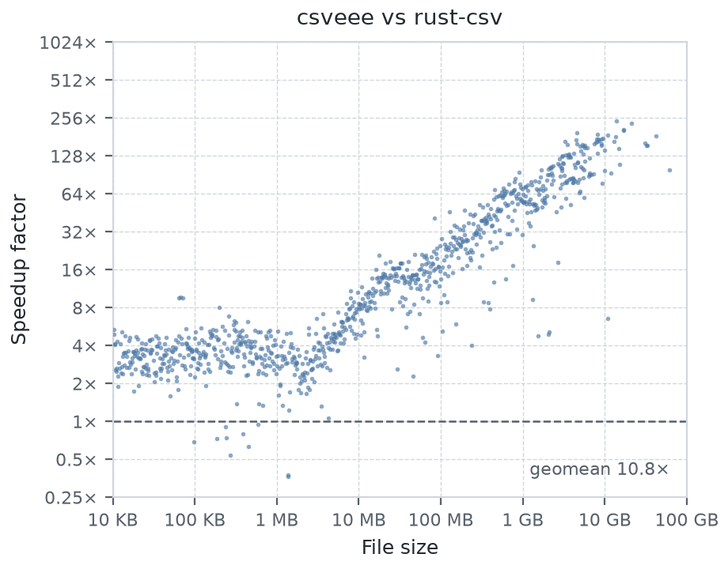
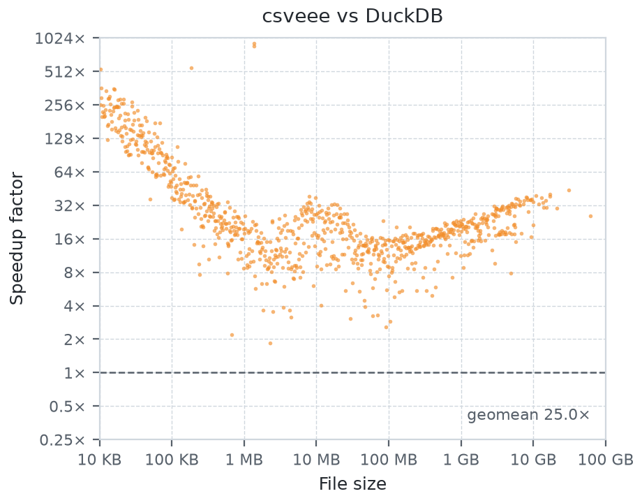

# csveee

A very fast, parallel CSV parser for Rust.

`csveee` parses a CSV file across all your cores. It splits the input into
chunks, parses them concurrently, and folds the per-worker results into one —
without giving up on the messy files the real world is full of. Across ~1,000
real-world CSV files it is around **10× faster than rust-csv**, and on a large
server it peaks at **192 GB/s**.

The parsing scheme and the fused accumulate-and-merge programming model come
from [*One Pass to Parse Them All: Fused Parallel CSV
Processing*](https://db.in.tum.de/~ellmann/papers/csveee.pdf) (VLDB '26); the
crate has grown past the paper since. See [How it works](#how-it-works).

## Features

- **Parallel by default.** Every chunk is parsed on its own thread and the
  per-worker results are folded back together in file order.
- **Parsing and processing in one pass.** Your record processing runs inside the
  parser, so records never take the trip out to memory and back — a round trip
  that holds throughput on larger-than-cache files well below memory bandwidth.
- **A SIMD chunk parser** on nightly, and a DFA-based one that builds on stable
  and handles every configuration.
- **Many dialects, not just RFC 4180, real files.** Configurable delimiters,
  terminators, escapes, comments, and three different quote handling modes.
  Records of varying length, `\r\n`/`\n`/`\r` and mixed newlines, headers,
  comments, blank lines.
- **I/O that suits the input.** Memory maps, a bounded ring buffer, per-chunk
  reads, or borrowed in-memory slices — picked automatically or chosen by hand.
- **No per-record allocation.** Fields arrive as mutable slices into the
  parser's own buffer. Nothing is copied unless you copy it.

## Usage

```rust
use csveee::Parser;

let mut parser = Parser::new();

let cities = parser.parse(
    "data.csv",
    Vec::new,
    |acc, [_name, _age, city]| {
        acc.push(city.to_string());
        Ok(())
    },
    |states| states.concat(),
)?;
```

Three arguments beyond the path: a function that creates a worker's initial
state, an accumulator called once per record, and a merge that folds the worker
states together. The array pattern in the accumulator declares the record
arity — a record with a different number of fields is an error.

`parse_slice` does the same for bytes already in memory, and `parse_stream` is a
sequential fallback for sources without random access.

### Configuration

`ParserBuilder` sets the dialect and the execution backends:

```rust
use csveee::{ParserBuilder, QuoteHandling, RecordTerminator};

let mut parser = ParserBuilder::new()
    .delimiter(b';')
    .quote(Some(b'"'))
    .quote_handling(QuoteHandling::Strict)
    .terminator(RecordTerminator::LF)
    .comment(Some(b'#'))
    .has_headers(true)
    .concurrency(4)
    .build();
```

- **Quote handling:** `Toggle` — every quote toggles quoting, whatever its
  position; `Strict` — RFC 4180, where a quote inside an unquoted field is an
  error; `Literal` — that same quote is an ordinary character.
- **Output modes:** fixed-arity arrays by default; `flexible()` hands the
  accumulator a slice so records may vary in length — validate in the
  accumulator to keep speculation cheap, see [How it works](#how-it-works);
  `bytes()` hands out `&mut [u8]` and skips UTF-8 validation entirely.
- **Execution:** concurrency, chunk size, parser backend, I/O backend, and a
  memory cap for the ring buffer.

The [`examples/`](examples) directory has a runnable program for each of these.

## Performance

Measured over 1,000 files from Kaggle on an AMD EPYC server, one point per file:

<p align="center">
  <picture>
    <source media="(prefers-color-scheme: dark)" srcset="docs/speedup-rustcsv-dark.png">
    
  </picture>
  <picture>
    <source media="(prefers-color-scheme: dark)" srcset="docs/speedup-duckdb-dark.png">
    
  </picture>
</p>

The geometric mean of per-file throughput is 7.7 GB/s — 4.7 GB/s with the DFA
parser on stable — against 0.8 GB/s for rust-csv and 0.3 GB/s for DuckDB: a
geometric-mean speedup of **10.85× over rust-csv** and **25× over DuckDB**.

The speedup is a curve, not a constant. Startup is a fixed cost, so the more
bytes there are to parse the smaller its share becomes, and the parsing that
remains is split across every available core. Against rust-csv, small files
spend most of their time in startup and land nearer 2–4×; from there the margin
widens with each extra byte and each extra core, past 200× on the largest files.
DuckDB pays a fixed per-query cost of its own, so its curve starts high, bottoms
out near 100 MB once that cost is amortized over enough bytes, and widens again
as parallelism takes over.

Benchmarks live in [`benches/throughput.rs`](benches/throughput.rs). Reproduce
them with:

```console
$ pip install -r scripts/requirements.txt
$ python3 scripts/provision_data.py   # downloads the corpora
$ cargo bench --features bench
```

## How it works

A chunk boundary can land anywhere, including in the middle of a quoted field,
so a worker cannot know the state its chunk starts in. Rather than scanning the
file first to find out, each chunk is parsed **speculatively** under every
possible starting state and the passes that turn out to be wrong are thrown away.

A merge phase then walks the chunks in order, aligning record boundaries: the
pass whose first record starts where its predecessor's last record ended is the
correct one. The surviving states are folded with the merge function. The cost
of the speculation is a constant factor of extra parsing work per chunk, and it
buys a parser that never has to look at the file twice.

What kills a wrong pass early is validation. The declared record arity and
errors the accumulator returns (e.g., failed type conversions) form the oracle
the speculation is checked against, so the more it rejects, the sooner a wrong
pass dies. An oracle with no information — `flexible()` together with an
accumulator that accepts every record — lets a wrong pass run to the end of the
chunk, and the mismatch surfaces only in the merge phase, which reparses that
chunk sequentially. The result is correct either way; the cost is the wasted
work.

Each chunk is handed to one of two parsers. The **DFA parser** drives a state
machine byte by byte; it supports every configuration and builds on stable Rust.
The **SIMD parser** (the `simd` feature, nightly-only, built on `portable_simd`)
finds delimiters, terminators, and quotes a vector at a time and resolves quoted
regions with bit-parallel arithmetic. It covers the common dialects and the
parser falls back to the DFA where it does not apply, so the choice is usually
one you can leave to `ParserBackend::Auto`.

Input is read through one of four I/O backends. **Memory maps** give each thread
its own private mapping and let the page cache do the work. A **ring buffer**
gives each thread its own bounded window, for large machines where mmap does not 
scale or the input is a stream. **Per-chunk reads** copy a chunk at a time into a
per-thread buffer. **Borrowed slices** parse in place with no copy at all. `Auto`
tries to pick the most suitable one.

Speculative parsing, the merge phase that fuses parsing with the user's
accumulator, the vectorized parser, and the ring buffer were developed and
evaluated in full in the [paper](https://db.in.tum.de/~ellmann/papers/csveee.pdf).
This crate is an extended version of what was evaluated there: the DFA
parser is the flexible-but-slower backend the paper leaves as future work,
and the dialect coverage and the other I/O backends likewise go beyond it.

## Correctness

The test suite parses ~2,500 real-world CSV files — 1,000 sampled from Kaggle,
DuckDB's and Postgres's own CSV test corpora, and rust-csv's — and compares
`csveee`'s output field for field against rust-csv, across output modes, parser
backends, and I/O backends. `cargo test` runs the checked-in fixtures; the larger
corpora are downloaded by `scripts/provision_data.py` (the Kaggle suite is opt-in
and needs credentials).

## Feature flags

| Feature | Description |
| --- | --- |
| `simd` | SIMD-vectorized chunk parser. Requires nightly. |
| `simdutf8` | SIMD-accelerated UTF-8 validation for `Text` output. |
| `trace` | `tracing` instrumentation. |
| `bench` | Required to build the benchmarks. |

All are off by default; the crate builds on stable with the DFA parser alone.

## Status

Early days — the API is not stable yet and may change between releases. Requires
Rust 1.88 or newer (edition 2024). Tested on Linux, macOS, and Windows.

## Citation

If you use `csveee` in academic work, please cite the paper:

> Simon Ellmann and Thomas Neumann. One Pass to Parse Them All: Fused Parallel
> CSV Processing. PVLDB, 19(11): 3579–3591, 2026.
> [doi:10.14778/3836663.3836710](https://doi.org/10.14778/3836663.3836710)

```bibtex
@article{ellmann2026onepass,
  author  = {Simon Ellmann and Thomas Neumann},
  title   = {One Pass to Parse Them All: Fused Parallel {CSV} Processing},
  journal = {Proceedings of the VLDB Endowment},
  volume  = {19},
  number  = {11},
  pages   = {3579--3591},
  year    = {2026},
  doi     = {10.14778/3836663.3836710}
}
```

The evaluation artifacts are at
[ackxolotl/csveee-evaluation](https://github.com/ackxolotl/csveee-evaluation).

## License

Licensed under either of

- Apache License, Version 2.0 ([LICENSE-APACHE](LICENSE-APACHE))
- MIT license ([LICENSE-MIT](LICENSE-MIT))

at your option.

### Contribution

Unless you explicitly state otherwise, any contribution intentionally
submitted for inclusion in the work by you, as defined in the Apache-2.0
license, shall be dual licensed as above, without any additional terms or
conditions.
